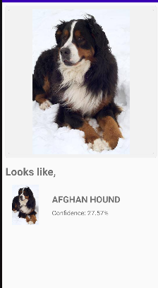
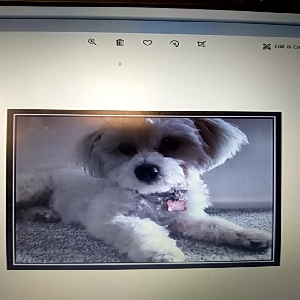
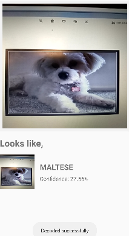

# 🐶 Dog Breed Identification Android Application

## 🌐 Overview

This Android application identifies dog breeds using a custom 12-layer deep learning model optimized for **real-time performance** on mobile devices. It uses **TensorFlow Lite** for efficient on-device inference, enabling predictions without needing an internet connection.

### ✨ Features

* 🐱 **Real-time dog breed detection** via device camera
* 📷 **Upload from gallery** for static image classification
* 🎯 **High accuracy with confidence scores**
* ⚡ **Optimized TFLite model** (quantized + multi-threaded)
* 📱 **Modern Material UI** with intuitive screens

### 🔎 Supported Dog Breeds

* MALTESE
* SCOTTISH DEERHOUND
* AFGHAN HOUND
* BERNESE MOUNTAIN DOG

---

## 🧰 Architecture

### 🧐 Deep Learning Model

* **Input:** 30x30 RGB image
* **Architecture:**
  `Conv2D → Conv2D → MaxPool2D → Dropout → Conv2D → Conv2D → MaxPool2D → Dropout → Flatten → Dense(256) → Dropout → Dense(4)`
* **Framework:** TensorFlow/Keras
* **Exported Format:** `dogbreed.tflite` (quantized)
* **Threads:** 4 (multi-threaded)

### 📲 Android App

* **Min SDK:** 21 (Android 5.0)
* **Real-time inference using CameraX / Intent**
* **File Picker for image upload**
* **On-device TFLite model loading**
* **ConstraintLayout-based UI**

---

## 🚀 Getting Started

### ✅ Prerequisites

* Android Studio Arctic Fox (2020.3.1) or later
* Android device or emulator (API 21+)
* Java 11+ installed and configured (via JDK)

### ⚡ Installation Steps

1. **Clone or Download the Repository**
2. **Open in Android Studio**
3. If prompted, click **"Sync Gradle"**
4. Connect your device OR create an emulator
5. Hit ▶️ Run

### 🛋 Asset Files (Auto-placed)

* `dogbreed.tflite` → Classification model
* `labelmap.txt` → Dog breed labels
* `detect.tflite` → (Optional) detection model

Ensure all are placed inside `app/src/main/assets/`

---

## 📊 Core Features in Detail

### 1. 📷 Image Upload

* Select image from device storage
* Display preview with file URI
* Automatically resizes to 30x30 before inference

### 2. 📊 Classification

* Model runs inference using the uploaded image
* Shows breed name + confidence score

### 3. 📱 Modern UI

* Uses ConstraintLayout and Material Design
* Clean layout for upload + result viewing

---

## 🔮 Model Training

### ⚖️ Dataset

* 4-class dog breed dataset
* Split: 80% training, 20% validation
* Size: \~65 images per class

### 🎓 Training

* 15 epochs
* Early stopping used
* Augmentation (rotation, flip, zoom)

### 🔌 Conversion

Run this script after training:

```bash
python convert_to_tflite.py
```

---

## 📦 Project Structure

```
dogbreed/
├── app/                # Android app module
│   ├── src/main/
│   │   ├── java/       # App logic (Java)
│   │   ├── res/        # Layouts, drawables
│   │   └── assets/     # .tflite, labels
│   └── build.gradle
├── model/              # ML model
│   ├── TRAIN.py
│   ├── convert_to_tflite.py
│   └── dogbreed.h5
├── screenshots/        # App previews
├── build.gradle        # Project build config
├── README.md
└── LICENSE             # Apache 2.0 License
```

---

## 🚀 Optimization Highlights

* ✅ Quantized model (float32 → int8)
* ✅ 30x30 input = reduced compute time
* ✅ XNNPACK delegate enabled
* ✅ All assets bundled for offline usage

---

## ❓ Troubleshooting

### App crashes on image upload?

* Ensure `labelmap.txt` and `dogbreed.tflite` are in `assets/`
* Check image is accessible from gallery (File URI)

### Model error: Input size mismatch?

* Your model input must be 30x30 RGB — make sure images are resized

### Gradle build failing?

* Use Java 11+
* Clean project: `Build > Clean Project`
* Invalidate caches if needed

---

## 🌐 Contributing

This project showcases:

* Real-time mobile inference
* TensorFlow Lite integration
* Android + ML hybrid dev

Fork it, re-train with your dataset, and build your own image classifier! 🤖

---

## 🔒 License

Apache 2.0. See `LICENSE` for full text.

---

## 🎨 Screenshots

| Upload                      | Prediction Result            |
|-----------------------------|------------------------------|
|  |   |
|   |  |

---

## 📄 Credits

Built using TensorFlow Lite + Android Studio — Inspired by the official [TFLite image classification example](https://github.com/tensorflow/examples/tree/master/lite/examples/image_classification/android).

---

**Note**: This is a demo-level app. For production-level performance, consider using larger datasets and better augmentation.
D
